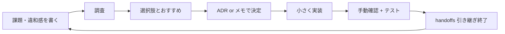

# 完成に向けた進め方 — フローチャート Web アプリ

**記録日:** 2026-05-20  
**きっかけ:** MVP + Phase 2 表 UI で動作確認済み（`simple_yes` 含む）。ここから「完成」に向けて進める方針を固定する。

---

## 1. 方針（最重要）

| 項目               | 内容                                                                                                                                                                                                     |
| ------------------ | -------------------------------------------------------------------------------------------------------------------------------------------------------------------------------------------------------- |
| **ゴール**         | ブラウザで実務に使える **フローチャート Web アプリを完成**させる                                                                                                                                         |
| **意思決定の基準** | [調査\_使いやすいフローチャート.md](./調査_使いやすいフローチャート.md) と [完成チェックリスト.md](./完成チェックリスト.md)。**MZ0000 は参照しない**（[ADR-007](<../03_技術仕様/意思決定記録(ADR).md>)） |
| **実装の SSOT**    | ADR + 上記。React Flow 版: `c:\yk-application\flowchart-studio`（Mermaid 版: `flowchart-web-mermaid` 予定 · ADR-010）                                                                                    |

**一文:** 表駆動 Web の使い勝手（入力・再生成・出力・下書き）を優先し、調査結果どおりに改善する。

---

## 2. 意思決定の出発点（MZ0000 廃止後）

| 使う                                  | 使わない                        |
| ------------------------------------- | ------------------------------- |
| Web 調査メモ（使いやすい要件・P0/P1） | デスクトップ exe の仕様書・写経 |
| 完成チェックリスト（M2 / UX / M3）    | 「MZ0000 と同じか」の比較       |
| 既存 fixture・`npm run test` の回帰   | Excel COM・Windows 専用 UX      |

表の列形式は**現行コードを維持**しつつ、列ヘルプ・CSV・エラー UX など**作者に優しい表現**へ段階的に変える（破壊的変更は別 ADR）。

---

## 3. これからの進め方（サイクル）

各機能・改善は次のループで進める。

| ステップ     | やること                                              | 成果物                                                      |
| ------------ | ----------------------------------------------------- | ----------------------------------------------------------- |
| **課題**     | 自分が使う場面で「足りない・気になる」を1つに絞る     | handoffs セッション MD §4（1 件）                           |
| **調査**     | Web 公式・類似ツール・React Flow のベストプラクティス | 調査メモ（短くてよい）                                      |
| **比較**     | 2〜3案 + **おすすめと理由**                           | ADR 草案                                                    |
| **決定**     | 採用案を ADR に追記                                   | `意思決定記録(ADR).md`                                      |
| **経緯索引** | タイムラインに1行追加（リンクのみ）                   | [`decision-log.md`](../05_開発ガイドライン/decision-log.md) |
| **実装**     | フェーズ計画の1タスク分だけ                           | PR / ローカル diff                                          |
| **確認**     | AC・目視・`npm run test`                              | チェックリスト更新                                          |

**スコープ:** 1 セッション = **1 テーマ**（表 UI + CSV + テーマを同時にやらない）。

---

## 4. 調査テーマの例（未着手・優先は都度決める）

完成に向けて、必要に応じて調べる候補。順序は固定しない。

| テーマ       | 問い                                             | 参考の出発点                           |
| ------------ | ------------------------------------------------ | -------------------------------------- |
| 入力         | 表 UI / CSV / JSON の最適な組み合わせは？        | Notion 表、スプレッドシート貼り付け UX |
| レイアウト   | 固定行高で十分か、テキスト計測は必要か？         | xyflow、自前格子 vs dagre              |
| エクスポート | PNG だけで足りるか、SVG・解像度は？              | xyflow #2717                           |
| 編集         | 読取専用のままか、どこまでキャンバス編集するか？ | ADR-006 の見直し                       |
| 見た目       | テーマは Web 用に何色・何サイズが読みやすいか？  | デザインルール（yk-skill）             |
| 品質         | バリデーション・エラー表示のベストは？           | 生成停止（ADR-002）の UX               |
| 運用         | localStorage・下書き・自分用フローの保存         | MVP+ / Phase 3                         |

調査結果は本フォルダに `調査_○○.md` を追加してよい（長大にしない）。

---

## 5. フェーズとの関係

| 既存フェーズ | 位置づけ                                          |
| ------------ | ------------------------------------------------- |
| Phase 1 MVP  | **動く土台** — 達成済み（手動 AC の棚卸しは任意） |
| Phase 2 実用 | 表 UI 着手済み。残りは**調査→決定→実装**で埋める  |
| Phase 3 拡張 | 「ベスト」候補が Phase 2 で足りなければここへ     |
| Excel 出力   | 本 Web アプリの完成条件**外**（別プロジェクト）   |

「完成」の定義は [完成チェックリスト.md](./完成チェックリスト.md)（A〜D すべて ✅）。

---

## 6. 次回セッションの入口

**2026-05-26:** Web 完成 ✅（[C-2 記録](c:/yk-memo/00.ai-driven-school/個人テーマ_フローチャートアプリ/99_アーカイブ/evidence/C-2_実務PNG貼付_記録_2026-05-26.md)）。次は handoffs §4（ADR-012 等）。

1. [`handoffs/flowchart-web/HANDOFF.md`](c:/yk-memo/handoffs/flowchart-web/HANDOFF.md) → **§4 だけ**
2. [AGENTS.md](../../AGENTS.md) — 境界 · SSOT
3. **本ファイル** — 方針（初回 or 迷ったとき）
4. `c:\yk-application\flowchart-studio` で実装（Mermaid 比較は ADR-010）

**完成の2段階:** Web 完成 = [完成チェックリスト](./完成チェックリスト.md) A〜D。年度テーマ完了 = [テーマ.md](c:/yk-memo/00.ai-driven-school/個人テーマ_フローチャートアプリ/00_テーマ/テーマ.md) §4。

新チャット用: [新チャット依頼.md](../新チャット依頼.md) をコピー（handoffs + AGENTS）。

---

## 7. 2026-05-20 セッション終了時点

| 項目          | 状態                                                    |
| ------------- | ------------------------------------------------------- |
| 動作確認      | OK（`localhost:3000`、表 UI + `simple_yes` プレビュー） |
| Phase 2 表 UI | 実装済み                                                |
| 本日の作業    | **終了** — 以降は上記サイクルで完成に向けて進める       |

---

_方針の変更は本ファイルと ADR を更新する。デスクトップ仕様書への追従は行わない。_
