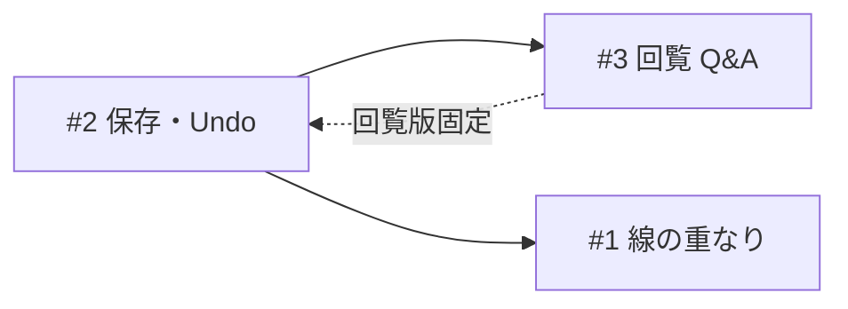

# 検証メモ — 実機確認からのブラッシュアップ候補（3件）

**状態:** grill-me 合意済（#1〜#15 · 2026-06-26）· **v1 完了**（#2 · #3 · 2026-06-26）· **v1.1 #1 エッジオフセット完了**（2026-06-26）  
**起点:** Step 6（import.json 再生成）完了後の実機検証（2026-06-26）  
**関連:** [HANDOFF §6](c:/yk-memo/handoffs/flowchart-studio/HANDOFF.md) · [ボタン一覧.md](../02_機能設計/ボタン一覧.md) · [DB設計.md](../03_技術仕様/DB設計.md)

---

## 利用手順（実機検証済み · 2026-06-26）

作業ディレクトリ: `c:\yk-application\flowchart-studio`

### 作者 — Excel → import.json

| #   | 作業                      | コマンド / 操作                                     |
| --- | ------------------------- | --------------------------------------------------- |
| 1   | xlsx の記入状況確認       | `npm run excel:inspect -- A0001`（警告のみなら OK） |
| 2   | 正規化 · import.json 出力 | `npm run excel:a0001:normalize`                     |
| 3   | 回帰確認                  | `pytest python/tests`（labels · normalize 含む）    |

正本 xlsx は Git 外 · 出力 `data/devices/A0001_塗布装置/import.json` は Git 内。詳細は [data/devices/README.md](../../data/devices/README.md) · [Excel取込.md](../03_技術仕様/Excel取込.md)。

### Web — import.json → プレビュー確認

| #   | 作業           | 操作                                                                                                                                                    |
| --- | -------------- | ------------------------------------------------------------------------------------------------------------------------------------------------------- |
| 1   | 起動           | `npm run dev` または [LOCAL_DEV.md](../LOCAL_DEV.md) の bat                                                                                             |
| 2   | ログイン       | `http://localhost:3000/login`（dev は `AUTH_DISABLED=1` 可）                                                                                            |
| 3   | 装置データ取込 | **その他 → import.jsonを取込…** → `import.json` を選択                                                                                                  |
| 4   | 動作確認       | 左ナビでユニット・動作を選択 → 表・図を目視（例: M002 分岐）                                                                                            |
| 5   | 表編集後       | ヘッダー **[再生成]** でプレビュー更新（workspaceMode では **プレビューのみ** · 保存は **[保存]** ボタンまたは Ctrl+S — **v1 #2 実装済み 2026-06-26**） |

### 運用上の注意

| 項目               | 内容                                                                          |
| ------------------ | ----------------------------------------------------------------------------- |
| import.json の反映 | **自動ではない**。normalize 後は必ず Web で「import.jsonを取込…」             |
| DB と Excel のずれ | 取込前は DB に古いモジュール一覧が残ることがある（取込後に Excel 本文と一致） |
| 本番               | https://flowchart-studio-dun.vercel.app — 手順は同型（editor ロール要）       |

---

## 検証で確認できたこと（前提）

| 項目                                  | 結果                               |
| ------------------------------------- | ---------------------------------- |
| `excel:inspect` / normalize / pytest  | OK                                 |
| import.json 取込 · M002 本文          | Excel どおり                       |
| Q6 `_x001F_` 除去 · Q7b `XXXX` 非表示 | 実装・確認済（本資料のスコープ外） |

---

## 1. フロー図の線の重なり

### 現象

横並び分岐（例: M002 · ID 2 → 3,4,5）や合流（3,4,5 → 6）で、複数エッジが**同じ縦線・水平バスを共有**し、1本に見える。

### 原因（技術）

- 表の **段・列** によるノード配置は再現できている
- エッジは React Flow `getSmoothStepPath` をそのまま使用
- **同じ出口・入口の並列エッジにオフセットを付けていない**

### 既知の整理

- [調査\_表列設計とレイアウト再現.md](../archive/01_要求定義/調査_表列設計とレイアウト再現.md) — 「合流バス」は v2 候補（v1.1 #1 エッジオフセットは 2026-06-26 実装済）
- BPMN 慣行: アノテーションは要素の隣 · チェックリスト付きピアレビュー（[Visual Paradigm BPMN Review](https://skills.visual-paradigm.com/docs/common-bpmn-mistakes-and-how-to-avoid-them/bpmn-review-practices-checklists-coaching/)）

### 対応案

| 案                      | 内容                                                                  | 規模 | 状態                                                                                    |
| ----------------------- | --------------------------------------------------------------------- | ---- | --------------------------------------------------------------------------------------- |
| **A. エッジオフセット** | 同一源/先のエッジに `getSmoothStepPath` の `centerX/Y` で数 px ずらす | 中   | **実装済（2026-06-26）** · `assignEdgePathOffsets` · `EDGE_PARALLEL_LANE_SPACING_PX=12` |
| **B. 合流バス**         | 分岐・合流用幹線を自前描画（調査メモの本格案）                        | 大   | v2 候補                                                                                 |

**たたき台:** まず **A** で改善幅を確認し、不足なら **B** を検討。

---

## 2. 保存タイミング · Undo/Redo · 未保存警告

### 現象・要望

表を触ると（再生成やモジュール切替で）**意図しないタイミングで DB に保存**される。Excel の Ctrl+Z / Ctrl+Y のように**戻したい**。**保存は作業者のタイミング**にしたい。未保存時は**警告**が欲しい。

### 現状の挙動（コード）

| タイミング              | 動き                                                        |
| ----------------------- | ----------------------------------------------------------- |
| セル編集                | `jsonText` のみ更新（`isStale` = プレビューが古い）         |
| **再生成**              | プレビュー更新 **＋** `onSnapshotPersist` → DB/ローカル保存 |
| **モジュール/装置切替** | 編集中の表も含め **そのまま保存**                           |
| Undo/Redo               | **なし**                                                    |

土台: `jsonText`（編集中）と `committedJson`（再生成済み）の分離 · `isStale` 表示は既にある。

### 要望 UI（案）

| ボタン         | 役割                                                                 |
| -------------- | -------------------------------------------------------------------- |
| **保存**       | DB（`persistModuleDraft`）へ明示保存。成功後を「保存済み」基準にする |
| **1個戻る**    | 表操作を 1 手戻す（Ctrl+Z 相当）                                     |
| **1個進む**    | Redo（Ctrl+Y 相当）                                                  |
| **未保存警告** | 保存済み ≠ 編集中のときバナーまたはボタン強調                        |

### 設計上の分離（案）

- **再生成** = プレビュー更新のみ（DB 書き込みしない）
- **保存** = DB 書き込みのみ
- モジュール切替時: 未保存なら **確認**（保存 / 破棄 / キャンセル）

### 規模感

エディタ状態 · ツールバー · 切替フロー · E2E — **1〜2 セッション**

---

## 3. 設計者 ↔ 回覧者のメモ（双方向）

### 要望

- **設計者（editor）** と **回覧者（viewer）** のやり取りが欲しい
- **質問と回答**の往復が必要（**双方向**）
- UI は既存と同様 **`<details>` で普段は閉じ、クリックで開く**形でよい
- メモの種別は未確定だが、候補は次の 3 階層:
  - **装置メモ** — 1/装置
  - **ユニットメモ** — 1/ユニット
  - **動作メモ** — 1/モジュール

### Web 調査・レビューの要点

| 出典                                                                                                                                        | 示唆                                                                  |
| ------------------------------------------------------------------------------------------------------------------------------------------- | --------------------------------------------------------------------- |
| [Figma Comments](https://help.figma.com/hc/en-us/articles/360041068574-Add-comments-to-files)                                               | アンカー付きスレッド · viewer も投稿可 · 解決済み管理                 |
| [FitGap 非同期レビュー](https://us.fitgap.com/stack-guides/reducing-review-cycle-time-with-asynchronous-evidence-based-requirement-reviews) | 正本と行単位フィードバックの分離 · Must fix / Question 等のタグ       |
| BPMN Review Practices                                                                                                                       | チェックリスト · 要素隣接アノテーション · ウォークスルー              |
| 製造回覧（社内整理）                                                                                                                        | 回覧の主戦場は **1 動作（モジュール）** · 指摘は **ID 付き** が実務的 |

### 推奨: メモを 2 系統に分ける

単一の「メモ」に設計メモと回覧 Q&A を混ぜると、Excel 再取込・権限・双方向の要件が衝突する。

#### A. 設計メモ（作者 · 主に editor）

| 階層     | 件数         | 用途例                        |
| -------- | ------------ | ----------------------------- |
| 装置     | 1/装置       | 客先前提 · 全体方針           |
| ユニット | 1/ユニット   | ユニット単位の前提            |
| 動作     | 1/モジュール | 動作の設計意図 · PLC 向け注意 |

- **主に editor が書く** · viewer は読取
- Excel マスターに「メモ」列を足せば SSOT 維持（再取込で反映）
- 保存先案: `devices` / `units` / `modules` の `memo` 列（`flow_documents.payload` には入れない）

#### B. 回覧メモ（設計者 ↔ 回覧者 · **双方向 Q&A**）

| 項目   | 内容                                                         |
| ------ | ------------------------------------------------------------ |
| 粒度   | **v1 は動作（モジュール）単位**を主戦場                      |
| 双方向 | 回覧者の**質問** · 設計者の**回答** · 必要なら追記の往復     |
| 権限   | **editor / viewer とも投稿可**（表セルは viewer 不可のまま） |
| 保存   | **Web 専用**（Excel 再取込で消えない）                       |
| UI     | 表下 `<details>`「回覧」— スレッド or 追記ログ形式           |

**双方向を満たす v1 の最小形（案）**

- モジュールごとに **時系列の追記ログ**（著者 · 日時 · 本文）
- 1 件の textarea だけでは「質問→回答」の対応が曖昧になるため、**v1 からログ配列**を推奨
- v1.5+: 行 ID 参照 · Must/Better/Want タグ · 解決済み
- v2: Figma 型スレッド · 通知

### UI 配置（案）

表の下 · 既存 `<details>` と同型:

```
▶ 確認（警告）
▶ 回覧（質問・回答）     ← **v1 実装済**
▶ 設計メモ（動作）       ← v1.1
▶ 設計メモ（ユニット/装置）← v1.1
▶ CSV / Excel 取込
▶ 列の意味（ヘルプ）
```

Nav には本文を載せず、**未読・未解決のドット**のみ（v1.5 以降でも可）。

### 既存プロダクトとの整合

- viewer は画面同型（ADR-013/014）→ 回覧欄だけ編集可は矛盾しない
- **#2 手動保存** と相性がよい（回覧中は「回覧版」固定 · 未保存警告とセットで検討）

---

## 3件の依存関係（grill 用）



- **#2** が土台（保存境界 · Undo スタック · 未保存警告）
- **#3** は回覧ログの永続化も #2 の保存モデルに依存
- **#1** は比較的独立（描画のみ）

---

## 段階導入（grill 合意）

| フェーズ | 内容                                                                          |
| -------- | ----------------------------------------------------------------------------- |
| **v1**   | #2 保存/Undo/警告 · #3 動作単位の回覧ログ（双方向）                           |
| **v1.1** | ~~#1 エッジオフセット~~ **実装済（2026-06-26）** · 設計メモ 3 階層 · Excel 列 |
| **v1.5** | 回覧: ID 参照 · タグ · Nav ドット                                             |
| **v2**   | #1 合流バス · 通知                                                            |

---

## grill-me 合意（2026-06-26）

| #   | 論点                       | 決定                                                                                  |
| --- | -------------------------- | ------------------------------------------------------------------------------------- |
| 1   | v1 スコープ                | **#2 + #3 のみ**（#1 線の重なりは v1.1 以降）                                         |
| 2   | モジュール切替（未保存時） | **確認ダイアログ**（保存 / 破棄 / キャンセル）                                        |
| 3   | 回覧メモの形               | **追記ログ**（著者 · 日時 · 本文 · 双方向 Q&A）                                       |
| 4   | 再生成 vs 保存             | **再生成 = プレビューのみ** · **保存 = DB のみ**                                      |
| 5   | 回覧ログの保存             | **投稿時に即 DB 保存**（表の保存とは独立）                                            |
| 6   | Undo/Redo 対象             | **表の編集のみ**（回覧ログは対象外）                                                  |
| 7   | 装置切替（未保存時）       | **モジュール切替と同じ確認**                                                          |
| 8   | v1 回覧の階層              | **動作（モジュール）単位のみ**                                                        |
| 9   | 回覧ログの編集・削除       | **editor / viewer とも編集・削除可**（社内利用 · 追記のみ不可は心理的ハードルが高い） |
| 10  | 回覧ログ編集の範囲         | **全ログを誰でも編集・削除可**（v1 スタート · 問題あれば権限を後から絞る）            |
| 11  | Undo の粒度                | **セル確定単位**（行追加/削除は各1操作=1手）                                          |
| 12  | 未保存警告                 | **バナー** + **保存ボタン強調**（プレビュー古い表示と併存）                           |
| 13  | 回覧ログ DB                | **別テーブル `review_notes`**（1行=1ログ）                                            |
| 14  | ショートカット             | **Ctrl+Z / Ctrl+Y**（表フォーカス時 · v1）                                            |
| 15  | 保存ショートカット         | **Ctrl+S = 保存**（ブラウザ既定は抑止）                                               |

### 未決（実装前に詰める · 軽微）

| 論点              | たたき台                                            |
| ----------------- | --------------------------------------------------- |
| Undo スタック上限 | 実装時 **50手** 程度を既定（グリル省略可）          |
| 設計メモ 3 階層   | **v1.1**（`devices/units/modules.memo` + Excel 列） |

### 次のステップ

1. ~~`ボタン一覧.md` に 保存 / 1個戻る / 1個進む を追記~~ **完了（2026-06-26）**
2. ~~実装 #2 保存/Undo/未保存警告~~ **完了（2026-06-26）**
3. ~~DB スキーマ確定（回覧ログ `review_notes` テーブル）~~ **完了（2026-06-26 · `017_review_notes.sql`）**
4. ~~実装 #3 — 動作単位の双方向回覧ログ~~ **完了（2026-06-26）**

---

## 参照

| 種類           | パス / URL                                                                                                                    |
| -------------- | ----------------------------------------------------------------------------------------------------------------------------- |
| 線の重なり調査 | [調査\_表列設計とレイアウト再現.md](../archive/01_要求定義/調査_表列設計とレイアウト再現.md)                                  |
| 保存・共同編集 | [意思決定記録 ADR-006/008/015](<../03_技術仕様/意思決定記録(ADR).md>)                                                         |
| viewer 方針    | [DB設計.md §2 #12](../03_技術仕様/DB設計.md)                                                                                  |
| BPMN レビュー  | https://skills.visual-paradigm.com/docs/common-bpmn-mistakes-and-how-to-avoid-them/bpmn-review-practices-checklists-coaching/ |
| Figma コメント | https://help.figma.com/hc/en-us/articles/360041068574-Add-comments-to-files                                                   |

---

**最終更新:** 2026-06-26（v1 #2/#3 · v1.1 #1 エッジオフセット実装完了 · 017 本番適用済）
