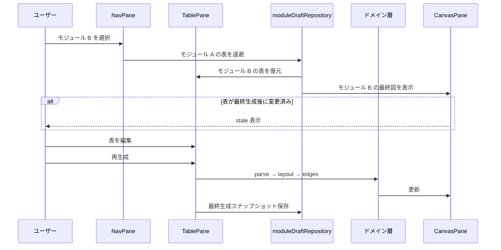
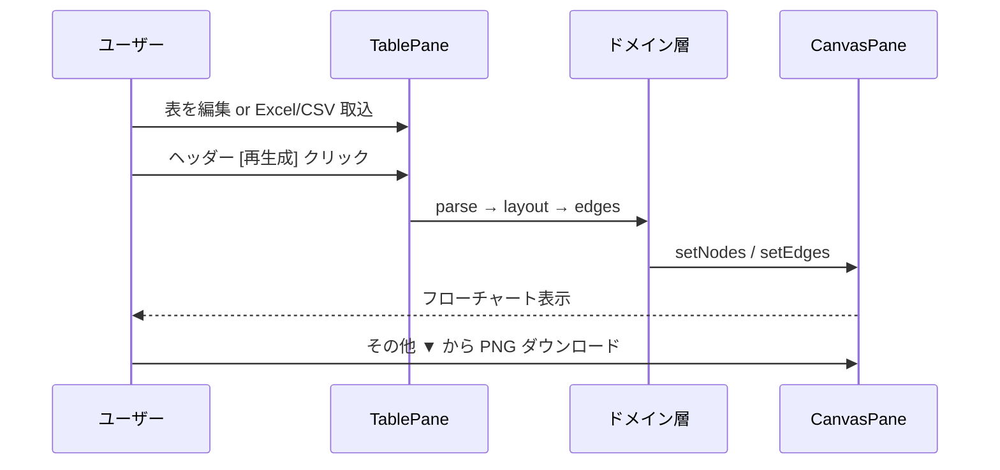

# UI 仕様 — 3ペイン ワークスペース

**更新:** 2026-06-25（Web→Excel TSV コピー計画）  
**目次:** [00\_目次.md](./00_目次.md)  
**関連:** [ADR-009](<../03_技術仕様/意思決定記録(ADR).md>) · [ADR-011](<../03_技術仕様/意思決定記録(ADR).md>) · [ADR-013](<../03_技術仕様/意思決定記録(ADR).md>) · [要求定義書.md](../01_要求定義/要求定義書.md) §4

---

## このアプリの考え方（7月デモ向け）

**表が正本（SoR）** · **図はプレビュー**。表を編集しても図は**自動では変わらない**。ヘッダーの **[再生成]** で表 → 図を同期する。プレビューは **D&D 編集不可**（閲覧専用）。

---

## 現行 UI（実装 · 2026-05-30）

`app/page.tsx` は **`FlowchartWorkspace`**（3 ペイン + ヘッダー）を表示。下記「Phase 3 ワイヤ」が実運用の骨格。2 ペイン記述は Phase 1/2 の歴史参照。

**ヘッダー常時ボタン（編集者）:** `[再生成]` · `[表を保存]` · `[表を読込]` · **その他 ▼**（PNG/SVG · サンプル · 下書き削除 等）— `flowchart-practical-ux-yk` ルール準拠。**再生成はヘッダーのみ**（TablePane 内に同名ボタンは置かない）。

**ボタン現状一覧（棚卸し）:** [ボタン一覧.md](./ボタン一覧.md) — 全画面 · 配置 · ID · スタイル系統 · 整理方針。操作契約は本ファイル以下を正とする。**ボタンを増減したら `ボタン一覧.md` も同一作業で更新。**

---

## レイアウト（2 ペイン）— 歴史参照（Phase 1/2）

> **現行（2026-05-30〜）:** 3 ペイン `FlowchartWorkspace` — 下記「Phase 3 ワイヤ」が正。2 ペイン図は Phase 1/2 の記録。

Web は **「表 | プレビュー」** の横 2 ペイン（第4回 diagram-manager の 3 ペインとは別設計）。Phase 1 は JSON 中心、Phase 2 以降は表 UI・CSV 貼り付けを同ペインに載せた。

```
┌──────────────────────────────────────────────────────────────────┐
│ AppHeader                                                        │
│  Flowchart Web · [再生成] · [表を保存][表を読込][画像を保存] · ステータス │
├─────────────────────────┬────────────────────────────────────────┤
│ TablePane (左 40% ※§E→52%) │ CanvasPane (右 60% ※§E→48%)           │
│                         │                                        │
│ · 表 UI（セル編集）     │  React Flow（読取専用）                │
│ · CSV 貼り付け・雛形    │  · nodesDraggable=false                │
│                         │  · Controls · stale オーバーレイ       │
│                         │                                        │
└─────────────────────────┴────────────────────────────────────────┘
```

**削除済み（UI 整理 · 2026-05-31〜）:** 表/JSON タブ切替 · テーマ/サイズセレクタ — [ui-simplification-yk.mdc](../../.cursor/rules/ui-simplification-yk.mdc)

### レスポンシブ

- 狭い画面: タブ切替「表 | 図」（実装済み）

---

## Phase 3 レイアウト案（3 ペイン）— 設計合意

**根拠:** 図解 WS の「選ぶ｜編集｜見る」3 ペイン思想 · grill-me セッション（2026-05-24）  
**実装:** [ADR-011](<../03_技術仕様/意思決定記録(ADR).md>) · `FlowchartWorkspace` · `ModuleNavPane` · Supabase 連携（ADR-013）。

### Excel / CSV 取込（CsvPastePanel）

**場所:** 左 **TablePane（表ペイン）** — **§D 合意後:** 表グリッドの**下** · `<details>` summary「CSV / Excel 取込」（デフォルト閉）。**現行コード:** `FlowTableEditor` ツールバーの下。モジュール未選択時は空状態のため**表示されない**（先に NavPane でモジュールを選ぶ）。

**表示条件:** 編集者（`readOnly=false`）かつモジュール選択済み。

| 操作               | 手順                                                                                                                       |
| ------------------ | -------------------------------------------------------------------------------------------------------------------------- |
| **コピー貼り付け** | Excel / スプレッドシートで表範囲をコピー → 点線枠内テキストエリアに貼り付け → **[貼り付けを反映]**                         |
| **Excel ファイル** | 同パネル内 **[Excel ファイル…]** → `.xlsx` / `.xls` を選択 → **先頭シートを自動読込**（シート手動選択 · 範囲指定は未実装） |
| **反映後**         | 表 UI に行が載る → ヘッダー **[再生成]** でプレビュー更新 · クラウド保存は **再生成時**（workspace モード）                |

**成功時メッセージ:** パネル内に「○ 行を表に反映しました。続けて「再生成」してください」と表示。

**失敗時:** 同パネル内にエラー文言（列数不一致 · 空データ · 非 Excel 拡張子 等）。

**7月デモ推奨シナリオ:** Excel ファイル読込 → **表内で Text 列などを部分貼り付け（Ctrl+V）** → **[再生成]** → プレビュー確認（[要求定義書.md](../01_要求定義/要求定義書.md) §5）。

### 表内部分貼り付け（FlowTableEditor）

**場所:** 同 **TablePane** の `FlowTableEditor` 本体（表グリッド内 · §D 後も変更なし）。

**表示条件:** 編集者（`readOnly=false`）。モジュール未選択時は表自体が空状態のため通常はモジュール選択後。

| 操作             | 手順                                                                                                           |
| ---------------- | -------------------------------------------------------------------------------------------------------------- |
| **部分貼り付け** | Excel / スプレッドシートで**範囲**をコピー → 表で貼り付け起点のセルをクリック → **Ctrl+V**                     |
| **適用範囲**     | 起点セルから**右・下**へ上書き。列は表幅（10 列）まで。行が足りない場合は**末尾に行追加**（ID は既存最大 +10） |
| **反映後**       | ヘッダー **[再生成]** でプレビュー更新（CsvPastePanel と同様 · 自動再生成なし）                                |

**CsvPastePanel との使い分け**

| モード           | 用途                                          | SSOT（コード）                                                        |
| ---------------- | --------------------------------------------- | --------------------------------------------------------------------- |
| **全表置換**     | 初回取込 · 表全体の差し替え                   | `CsvPastePanel` · `parseCsvPaste`（6 列以上 · ヘッダー行判定あり）    |
| **部分貼り付け** | Text1–3 等の微調整 · Excel から数セルだけ更新 | `FlowTableEditor` · `pasteTableCells.ts`（生 TSV · ヘッダー判定なし） |

**実装メモ（エージェント向け）:** フォーカス位置は `useRef`（`useState` だと paste 直後に起点が取れない）。`onPasteCapture` で input 既定の 1 セル貼り付けより先に処理する。

### Web → Excel（TSV コピー）

**一覧:** [ボタン一覧.md](./ボタン一覧.md)（M 書き出しセクション · T2/T3）

**場所:** **その他 ▼** → **書き出し**（2026-06-25 整理）。`FlowTableEditor` ツールバーからは移動済み。

| 操作                 | クリップボード内容                           | 用途                                   |
| -------------------- | -------------------------------------------- | -------------------------------------- |
| **表をコピー**       | データ行のみ（TSV · **ヘッダーなし**）       | Web 微修正 → 既存 Excel テーブルへ貼付 |
| **ヘッダーをコピー** | **10 列ヘッダー行のみ**（`columnFormatTsv`） | 空白シートに列構造を貼る               |

**状態:** 実装済み（2026-06-25 · `copyTableUtils.ts` · `EditorMoreMenu` 書き出し）。

**段階2（後回し）:** Python で 1 フロー JSON → 装置 xlsx の該当テーブル更新。

### 表ペイン UX（レイアウト · スクロール · 列幅）

**方針 SSOT:** [表ペインUX方針.md](./表ペインUX方針.md)（実装済 · 2026-06-25 · `523a008`）

**ADR-016 PR-A（実装済 · `67eff04`）:** 10列 v2（色 index 2）· ヘッダー短縮 · 接続先列 48px · `minWidth` · v1→v2 マイグレーション。詳細は [ADR-016](<../03_技術仕様/意思決定記録(ADR).md#adr-016-10-列順-v2--3-ペインリサイズ2026-06-25>)。

### ワークスペースレイアウト（3ペインリサイズ · ナビ配色）

**方針 SSOT:** [ワークスペースレイアウト方針.md](./ワークスペースレイアウト方針.md)（PR-B **実装済** · UX改善パック §D〜§E **合意済 · 未実装**）

| 項目                          | 状態                                                                                                                                    |
| ----------------------------- | --------------------------------------------------------------------------------------------------------------------------------------- |
| ナビ｜表｜図 ドラッグリサイズ | **実装済**（`react-resizable-panels` v4 · PR-B）                                                                                        |
| ナビ左揃え（`justify-start`） | **実装済**                                                                                                                              |
| ナビ｜表間余白解消            | 合意済 · 未実装（`fcNavAside` 固定幅除去 · [同書 §D](./ワークスペースレイアウト方針.md#d-ナビ表ペイン間の余白2026-06-25-合意--未実装)） |
| 表｜図デフォルト比率 v2       | 合意済 · 未実装（52:48 · [同書 §E](./ワークスペースレイアウト方針.md#e-デフォルト比率改定--ペイン幅リセット2026-06-25-合意--未実装)）   |
| ペイン幅リセット（T4）        | 合意済 · 未実装                                                                                                                         |

### 表ペイン縦優先（2026-06-25 合意 · 未実装）

**方針 SSOT:** [表ペインUX方針.md §D](./表ペインUX方針.md#d-表ペイン縦優先レイアウト2026-06-25-合意--未実装)

| 項目                | 決定                                            |
| ------------------- | ----------------------------------------------- |
| 表の位置            | ヘッダー直下 · **最上段**                       |
| エラー              | 表の**上**（`role="alert"` · 現行維持）         |
| 警告                | 表の**下** · `<details>` デフォルト閉           |
| 取込 · 列ヘルプ     | 表の**下** · `<details>` デフォルト閉（現行型） |
| T4 列幅リセット     | **廃止**                                        |
| T4 ペイン幅リセット | 表ツールバーに新設                              |

---

1 装置あたりフローは多数（例：プレス機 → 供給／プレス／収納ユニット → 各モジュール動作）。**一画面に全部は載せられない**ので、切り替えながら表を微調整し図を確認する。フロー作成者は **Excel で表を作り、取込後に Web で切替・微調整** する想定。

### 5 項目の割り当て（物理ペインは 3 ＋ ヘッダー）

| 項目                 | 置き場                                                    | 備考                                                        |
| -------------------- | --------------------------------------------------------- | ----------------------------------------------------------- |
| **装置名**           | **NavPane 最上段**（`<select>` で装置切替 · デモ 2 装置） | ヘッダーには出さない · 永続化キー `${deviceId}:${moduleId}` |
| **ユニット名**       | **Pane1 第 1 階層**                                       | 折りたたみリスト（例：供給・プレス・収納）                  |
| **動作モジュール**   | **Pane1 第 2 階層**                                       | 選択単位＝フロー 1 本。クリックで Pane2/3 の中身を切替      |
| **フロー作成用の表** | **Pane2**                                                 | **10 列表** UI（推奨）· CSV/JSON · Excel 取込後の微調整     |
| **フロー図**         | **Pane3**                                                 | React Flow（読取専用）· モジュールごとの最終生成図          |

第 4 回 diagram-manager の **3 ペイン**（ナビ｜一覧｜詳細）に相当するが、本アプリは **詳細の代わりに「表｜図」の同時表示** を維持する（再生成・stale UX のため）。

### ワイヤ（デスクトップ・ワイド）

```
┌────────────────────────────────────────────────────────────────────┐
│ AppHeader                                                          │
│  文脈（ユニット·動作）· [再生成] · 表を保存 · 表を読込 · その他 ▼   │
├──────────────┬──────────────────────────────┬──────────────────────┤
│ NavPane      │ TablePane                    │ CanvasPane           │
│ (左)         │ (中央)                       │ (右)                 │
│              │                              │                      │
│ [装置 ▼]     │ 選択中モジュールの 10 列表    │ 同モジュールの       │
│ ユニット ▼   │ · CSV 貼り付け               │ フロー図             │
│  モジュールA │                              │ · stale オーバーレイ │
│  モジュールB │                              │                      │
│  …           │ 未選択時: 空状態（§下表）     │ 未選択時: 空状態     │
└──────────────┴──────────────────────────────┴──────────────────────┘
```

**比率目安（PR-B 現行コード）:** Nav **18%** · Table **40%** · Canvas **60%**（内側 Group · ドラッグ可 · `localStorage` 永続化）。

**次（§E 合意 · 未実装）:** Table **52%** · Canvas **48%** · storage キー `-v2`。詳細は [ワークスペースレイアウト方針 §E](./ワークスペースレイアウト方針.md#e-デフォルト比率改定--ペイン幅リセット2026-06-25-合意--未実装)。

**D 要望（2026-05-31）:** フローは縦長のため **CanvasPane を画面上端〜下端まで**使う — **プレビュー chrome 縦レイアウトで対応済**（2026-06-25 · [プレビュー上部chrome方針.md](./プレビュー上部chrome方針.md)）。横ペイン比率の可変化は PR-B 実装済 · デフォルト比率改定は §E。

### 操作・状態（合意済み）

| 操作                               | 挙動                                                                                                         |
| ---------------------------------- | ------------------------------------------------------------------------------------------------------------ |
| モジュール選択                     | Pane2 にそのモジュールの表、Pane3 に**前回生成した図**を表示                                                 |
| 表を編集して未再生成               | Pane3 は前回図のまま · StatusBar 等で **「プレビューは古い」**（Phase 2 の stale UX を**モジュール単位**に） |
| モジュール切替                     | **モジュールごとに表を自動退避・復元**（有力案）。保存先 API は未確定 → `repository` で差し替え可能に        |
| ユニットのみ展開・モジュール未選択 | Pane2/3 は**空状態**（「モジュールを選択してください」）                                                     |
| 再生成                             | 選択中モジュールの表 → 生成 → Pane3 更新 · 当該モジュールの「最終生成スナップショット」を更新                |

### レスポンシブ（Phase 3）

| 画面幅                 | 挙動                                                                           |
| ---------------------- | ------------------------------------------------------------------------------ |
| ワイド（主）           | 3 ペイン横並び                                                                 |
| 狭い（ノート半画面等） | Pane1: 折りたたみ or ドロワー · Pane2｜Pane3: タブ「表｜図」（Phase 2 と同型） |

### Excel / 巨大ファイル（未決 · 設計メモ）

| 項目         | 現時点の予想・方針                                                                         |
| ------------ | ------------------------------------------------------------------------------------------ |
| ファイル構造 | **1 装置 = 1 Excel** · **1 ユニット = 1 シート** 程度（1 モジュール 1 シートは難しい想定） |
| 抽出         | ファイル全体からフロー用表だけ **Python 等でプログラム抽出**する可能性                     |
| UI 入口      | **未決**（ヘッダー一括 vs Pane2 単体再取込などは実装前に相談）                             |
| 永続化       | AI スクール「データ保存」授業後に保存先確定。切替時自動退避は**有力**だが binding は後     |

### Phase 3 将来拡張

- **複数装置:** **実装済み（2026-05-30）** — Nav 最上段 `<select>`（デモ 2 装置）。本番 DB 連携は ADR-013
- **PLC コメント表:** Pane2 をタブ「PLC 表｜8 列表」にする案（[テーマ.md](c:/yk-memo/00.ai-driven-school/個人テーマ_フローチャートアプリ/00_テーマ/テーマ.md) の入力正本）
- **Pane1:** `workspace-ui-kit` の `Pane1Toggle` / Sidebar 2 階層パターンを参考（[WORKSPACE_RULES.md](c:/yk-skill/rule/20_web_workspace/WORKSPACE_RULES.md)）

### Phase 3 用コンポーネント（予定名 → 実装状況）

| コンポーネント          | 責務                                                                          |
| ----------------------- | ----------------------------------------------------------------------------- |
| `FlowchartWorkspace`    | 3 ペイン統合 · 装置/ユニット/モジュール選択状態 — **実装済み**                |
| `ModuleNavPane`         | Pane1 · **装置 select（最上段）** + ユニット→モジュール 2 階層 — **実装済み** |
| `FlowchartEditor`       | Pane2+3（既存を分割配置 or ラップ）                                           |
| `moduleDraftRepository` | モジュール ID 単位の表下書き・最終生成図の取得/保存（mock → 本実装）          |

### 主要操作フロー（モジュール切替）



---

## コンポーネント一覧

| コンポーネント                  | 責務                                         |
| ------------------------------- | -------------------------------------------- |
| `FlowchartEditor`               | 2 ペイン統合 · 生成 · stale UX（実装の中心） |
| `FlowTableEditor`               | 表 UI · 行追加削除                           |
| `AppHeader` / ツールバー        | 再生成 · 表保存/読込 · PNG/SVG（その他 ▼）   |
| `CanvasPane` / `FlowCanvas`     | React Flow ラッパー                          |
| `FlowShapeNode` · `LabeledEdge` | 5 種ノード · Yes/No エッジ                   |
| `StatusBar`                     | ノード数 · エラー/警告 · プレビュー古い表示  |

---

## ノードの見た目

| 種別     | 形状       | 備考          |
| -------- | ---------- | ------------- |
| 端子     | 角丸矩形   | 開始/終了     |
| 処理     | 矩形       | デフォルト    |
| 判断     | 菱形       | 高さ 1.3 倍   |
| 入出力   | 平行四辺形 | CSS / SVG     |
| 手動入力 | 台形風     | 簡略 SVG で可 |

**色・テーマ:** テーマ切替は**削除**。枠色は `flowColors.ts` 固定 · ノード背景は表「色」列（**現行 v1:** index 9 · **v2 予定:** index 2 — [ADR-016](<../03_技術仕様/意思決定記録(ADR).md#adr-016-10-列順-v2--3-ペインリサイズ2026-06-25>)）— [作者ガイド.md](../03_技術仕様/作者ガイド.md)

---

## 主要操作フロー

### 表編集 → 再生成 → 出力（通常）



### stale（プレビュー古い）からの回復

表・JSON を変更したあと **再生成していない** とプレビューは前回図のまま（ADR-006）。

| 表示                                           | 意味                               |
| ---------------------------------------------- | ---------------------------------- |
| ヘッダー StatusBar「**プレビューは古い —**」   | 表と図が不一致                     |
| プレビュー枠の **琥珀色リング** + オーバーレイ | 同上（視覚強調）                   |
| 「画像を保存」不可 / StatusBar に案内          | PNG/SVG は stale 中ブロック（B-1） |

**対処（1 手順）:** ヘッダー **[再生成]** を押す → プレビュー更新 → PNG/SVG が可能に。

オーバーレイ内の「再生成」リンクも同じボタンを起動する（CanvasPane 上）。

---

## エラー・空状態

| 状態                              | 表示                                                                                              | 対処                                                                                                                                      |
| --------------------------------- | ------------------------------------------------------------------------------------------------- | ----------------------------------------------------------------------------------------------------------------------------------------- |
| 表が空                            | 「表にデータを入力するか、サンプルを読み込んでください」                                          | CsvPastePanel · 雛形（その他 ▼）· 表 UI で入力                                                                                            |
| パースエラー                      | StatusBar 赤 + 行ハイライト · クリックで行ジャンプ                                                | 該当行を修正 → **[再生成]**                                                                                                               |
| 警告                              | 琥珀色 · **表の下** · `<details>` デフォルト閉（2026-06-25 合意 · 未実装）· 生成は継続（ADR-009） | 警告行を確認 · 必要なら修正 → 再生成                                                                                                      |
| 接続先不明                        | **生成停止** + エラー一覧（ADR-002）                                                              | 接続先 ID を修正 → **[再生成]**                                                                                                           |
| **表変更後・未再生成（stale）**   | StatusBar「プレビューは古い」· プレビュー琥珀枠 · PNG/SVG ブロック                                | **ヘッダー [再生成]**                                                                                                                     |
| 0 ノード                          | キャンバスにプレースホルダ                                                                        | 表に有効行を追加 → **[再生成]**                                                                                                           |
| モジュール未選択（Phase 3）       | Pane2/3:「モジュールを選択してください」                                                          | NavPane でモジュールを選択                                                                                                                |
| モジュール初回・表なし（Phase 3） | 「Excel から取込むか、表を入力してください」                                                      | **CsvPastePanel** または表 UI                                                                                                             |
| Excel 読込 — 意図しないシート     | 先頭シートを自動選択（シート名は成功メッセージに表示）                                            | 別シートが必要なら Excel 側で先頭に移すか、**表内部分貼り付け**（Ctrl+V）で必要範囲だけ反映（xlsx ファイルのシート/範囲指定 UI は未実装） |

---

## デスクトップ版との対応（歴史参照 · [ADR-007](<../03_技術仕様/意思決定記録(ADR).md>)）

新機能の判断には使わない。UX 比較のメモとして残す。

| デスクトップ版の概念    | Web（現在）                                            |
| ----------------------- | ------------------------------------------------------ |
| Excel 選択ポーリング    | 表が SoR                                               |
| 表全体から生成          | デフォルト動作                                         |
| CSV / 表編集            | 表 UI · CSV 全表貼り付け · **表内部分貼り付け**（✅）  |
| 雛形                    | JSON テンプレ 2 種（✅）                               |
| スマート・パレット      | 未（Phase 3+ 候補）                                    |
| ユニット→モジュール切替 | **実装済み**（`FlowchartWorkspace` · `ModuleNavPane`） |
| Excel 装置ファイル一括  | 未（抽出方式・UI 未決）                                |
| ミニモード · 常時最前面 | なし（Web 対象外）                                     |

---

_ペイン幅のドラッグリサイズは [ワークスペースレイアウト方針.md](./ワークスペースレイアウト方針.md)（PR-B **実装済** · デフォルト比率 v2 · ペイン幅リセットは §E **未実装**）。_
